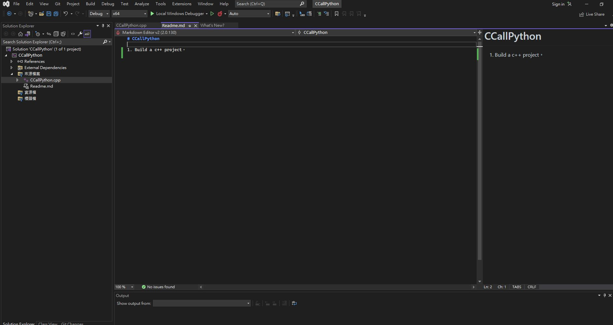
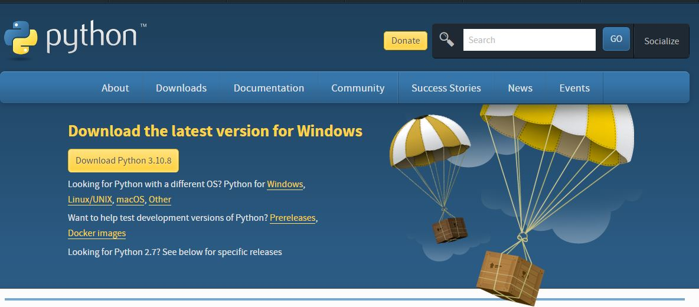

# CppCallPython
This project it's helping you interactive with Python function when you are using C++ base on Visual Studio 2022.

### 1. Build a c++ project
   
### 2. Download Python for windows
   - First you should download [Python](https://www.python.org/downloads/) and check whole boxes when you install, and remeber your python path.
    
    
### 3. import Python for C++ to use it
   - View->Property Manager->Right Click CCallPython(project)->Properties - It'll pop up project Property Pages.
    
   - In order to add Python includ and libraries's path
   VC++ Directories -> Include Directories add "C:\Program Files\Python310\include"
    
   - VC++ Directories -> Library Directories add "C:\Program Files\Python310\libs"
    
   - Linker -> Input add "python310.lib"
    
### A.Troubleshooting
   - If you got and error or when you running project it's return can't found python310.lib, please check your Python version and its PATH.

    
### 3. Run C++ code and check the result.
   - #### Workflow
      